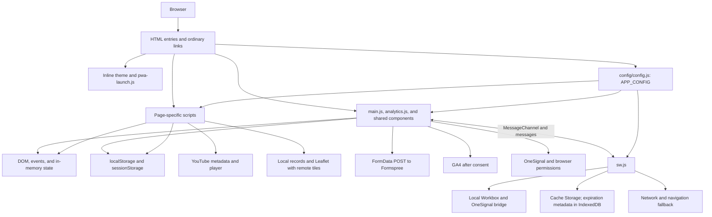

# CONTEXT — agent guide

## 1. Purpose and domain

Spanish-language website for Monterrey Baptist Church (IBMty).
Presents events, messages, ministries, missions, church information, and content about salvation.
Includes contact forms, donation information, and application preferences.
Served as a static, multi-page website with an implemented PWA experience.

## 2. Stack and verified versions

Versions come from HTML references, library headers, and executable configuration. There is no application package manifest: no `package.json`, `requirements.txt`, `pyproject.toml`, `go.mod`, or `composer.json`. The application also has no TypeScript, Vite, Next.js, Webpack, Astro, or Tailwind configuration, and no Dockerfile. The frontend is neither transpiled nor bundled.

| Technology | Version in source | Source and use |
| --- | --- | --- |
| Application | `7.1.3` | `APP_CONFIG.appVersion`; also the fallback in `sw.js` |
| HTML, CSS, and JavaScript | No language edition pinned | HTML with classic scripts, plain CSS, and browser APIs |
| Bootstrap | `5.3.8` | CDN CSS and JS bundle on the six main pages |
| Swiper | `14.2.0` | CDN CSS and JS bundle in `index.html` and `nosotros.html` |
| GSAP and ScrollTrigger | `3.15.0` | Local files in `gsap-public/minified/` |
| Flip and TextPlugin | `3.15.0` | Local files present; no HTML page loads them |
| Leaflet | `1.9.4+v1.d15112c` | Header of `leaflet/dist/leaflet.js`; map in `nosotros.html` |
| Workbox | `7.4.1` | `js/workbox-sw.js` loader and six local modules in `workbox/` |
| canvas-confetti | `1.9.4` | CDN in `salvacion.html` |
| OneSignal Web SDK | `v16`, no patch pinned | Remote SDK and `js/OneSignalSDK.sw.js` bridge |
| YouTube Data API | `v3` | Requests from `js/components/youtube-api.js` |
| Google Analytics | GA4; unpinned `gtag.js` | Dynamic loading from `js/utils/analytics.js` |
| Formspree | Unversioned service | Browser-side form POST requests |
| Python, Node.js, and Playwright | Not pinned by the repository | Inventory generation and update testing |
| GitHub Actions: checkout | `v6`, no patch or SHA pinned | `.github/workflows/main.yml` |
| FTP-Deploy-Action | `v4.4.0` | Two publishing steps in the workflow |

Poppins and League Spartan are distributed as local fonts; the application declares no font version. Versions installed on a development machine are not project-pinned requirements.

## 3. Directory tree and responsibilities

```text
.
├── index.html                     # Home, events, video, and Bible resource
├── nosotros.html                  # Philosophy, history, missions, ministries, and contact
├── salvacion.html                 # Content, cards, and follow-up modal
├── donativo.html                  # Donation information and copy controls
├── privacidad.html                # Privacy notice
├── settings.html                  # Preferences; redirects home outside standalone mode
├── splash.html                    # PWA entry and transition to home
├── offline.html                   # Connection recovery screen
├── manifest.json                  # PWA identity, start URL, scope, and icons
├── sw.js                          # Precache, runtime caches, and update protocol
├── config/
│   └── config.js                  # APP_CONFIG shared by pages and worker
├── css/
│   ├── main.css                   # Fonts, tokens, themes, and shared components
│   ├── components/carousel.css    # Carousel presentation
│   └── pages/                     # Seven page stylesheets; offline uses main.css
├── js/
│   ├── main.js                    # Shared initialization, forms, sharing, and PWA
│   ├── pwa-launch.js              # Early detection and standalone entry
│   ├── workbox-sw.js              # Local Workbox loader
│   ├── OneSignalSDK.sw.js         # Remote OneSignal worker import
│   ├── utils/analytics.js         # Consent, GA4 loading, and events
│   ├── components/
│   │   ├── animations.js          # GSAP, ScrollTrigger, navbar, hints, and splash
│   │   ├── carousel.js            # Two Swiper carousels and hash navigation
│   │   ├── missionaries-map.js   # Local records, grouping, and Leaflet map
│   │   ├── push.js                # SDK, permissions, subscription, and notification controls
│   │   └── youtube-api.js         # Schedule, countdown, latest video, and live detection
│   └── pages/
│       ├── nosotros.js            # Form action and success state
│       └── salvacion.js           # Cards, follow-up validation, and confetti
├── assets/
│   ├── fonts/                     # Poppins and League Spartan; WOFF2, TTF, and OFL licenses
│   ├── icons/                     # Logos, PWA icons, and SVG sprite
│   ├── images/                    # Events, ministries, missions, and editorial assets
│   └── calendar/                  # Downloadable ICS calendar
├── gsap-public/minified/          # Local GSAP and plugin distributions
├── leaflet/dist/                  # Local distribution consumed by HTML and precache
├── workbox/                       # core, routing, strategies, expiration,
│                                  # cacheable-response, and precaching distributions
├── .github/
│   ├── tests/update-flow.cjs      # Node/Playwright test using temporary copies
│   └── workflows/main.yml         # Publishing on a push to main
├── docs/                         # Previous audit artifacts; not executable source
├── robots.txt                    # Crawler directives
├── sitemap.xml                   # URL inventory for search engines
├── THIRD_PARTY_NOTICES.md         # Third-party notices file
├── .gitignore                    # Local and tooling exclusions
├── CONTEXT.md                    # Technical map for agents
└── README.md                     # Public overview and setup
```

Agent tooling directories, installed dependencies, and lockfiles are not expanded here; skill locations are covered in section 11. `leaflet/dist/` is identified because the application explicitly consumes it, despite being a prebuilt distribution.

## 4. Architecture and data flow

Each HTML URL is an independent entry point. Ordinary links and fragments provide navigation; there is no SPA router, application server, CMS, or project database. Navigation, footer, and shared controls are repeated in HTML without a template engine.

Before content renders, an inline script applies `data-theme` from the saved or system preference. `pwa-launch.js` establishes standalone mode. Classic scripts load libraries and globals; application initializers run mainly on `DOMContentLoaded` and check for their target elements.

Content lives in HTML and assets. Map records live in `MISSIONARIES` inside `missionaries-map.js`. Forms send `FormData` directly to the configured service. Video integration fetches remote metadata and renders it into the DOM. Preferences use Web Storage; HTTP resources use Cache Storage.



Remote services require a connection and valid configuration. Cached video metadata does not mean the video itself is downloaded. There is no offline form queue or subsequent synchronization of submissions.

## 5. Module connections and contracts

### Actual page loading

Application frontend code has no ES Module imports/exports. Connections use `<script>` tags, globals, the DOM, and events. The worker uses `importScripts`; the test uses CommonJS `require`.

The six main pages (`index`, `nosotros`, `salvacion`, `donativo`, `privacidad`, `settings`) declare this shared sequence after early theme setup:

```text
Bootstrap bundle → config/config.js → OneSignal SDK → push.js
→ analytics.js → main.js → GSAP → ScrollTrigger → animations.js
```

The OneSignal SDK is remote; `OneSignalDeferred` coordinates its availability. This sequence describes HTML references, not guaranteed download timing for asynchronous scripts.

| Entry | Additional dependencies / differences |
| --- | --- |
| `index.html` | Swiper → `carousel.js` → `youtube-api.js`; carousel and home CSS |
| `nosotros.html` | Swiper → `carousel.js` → `pages/nosotros.js` → Leaflet → `missionaries-map.js`; Leaflet, carousel, and page CSS |
| `salvacion.html` | canvas-confetti → `pages/salvacion.js`; salvation page CSS |
| `donativo.html`, `privacidad.html`, `settings.html` | Shared sequence and page CSS; settings also redirects early outside standalone mode |
| `splash.html` | Configuration, analytics, main, GSAP, ScrollTrigger, and animations; no Bootstrap or push SDK |
| `offline.html` | `main.css`, inline theme, and inline retry code for clicks or `online`; does not load `main.js` |
| `sw.js` | Configuration → OneSignal bridge guarded by try/catch → Workbox loader → six local modules |

### Symbols and connection points

| File | Consumes | Provides / observable effect |
| --- | --- | --- |
| `config/config.js` | Configuration written in code | `const APP_CONFIG`, a classic-script global binding; not declared as `window.APP_CONFIG` |
| `main.js` | APP_CONFIG, DOM, browser APIs, and optional analytics functions | `isStandaloneMode`, `makeIcon`, `setIcon`, `makeToast`, `toggleTheme`, `shareContent`, `copyToClipboard`, `submitFormData`, `clearFormErrors`; initializes preferences, forms, and worker |
| `utils/analytics.js` | APP_CONFIG and `cookieConsent` | `startAnalytics`, `trackEvent`, `trackPageView`, `trackFormSubmit`; creates `window.gtag` and `dataLayer` on startup |
| `components/push.js` | APP_CONFIG, OneSignalDeferred, `isStandaloneMode`, `makeIcon`, `setIcon`, `makeToast`, `AppPopups`, DOM controls | Toggle state from the live SDK subscription; one-time PWA offer queued through `AppPopups` as `notifications`; denied/error feedback via toast |
| `components/animations.js` | GSAP, ScrollTrigger, and page selectors | Globals `ANIM`, `SCROLL_TRIGGER_DEFAULTS`, initializers, and `goToIndex`; refreshes after fonts and Bootstrap collapse events |
| `components/carousel.js` | Swiper, optional ScrollTrigger, and hashes | Local initialization of `eventos-swiper` and `ministerios-swiper`; instance available on `element.swiper` |
| `components/youtube-api.js` | APP_CONFIG, `#live-stream`, fetch, storage, and optional ScrollTrigger | Countdown and video blocks; functions enclosed in the load listener |
| `components/missionaries-map.js` | Leaflet global `L`, `makeIcon`, document theme, and local records | `MISSIONARIES`, `initMissionariesMap`; proximity grouping, continent filters, and popups |
| `pages/nosotros.js` | APP_CONFIG, `#contact-form`, and `form-success` | Sets action, hides the form, and displays confirmation |
| `pages/salvacion.js` | GSAP/ScrollTrigger, Bootstrap.Modal, confetti, APP_CONFIG, `submitFormData`, optional analytics | Card stack, prayer/follow-up modal, specialized validation, and celebration |
| `.github/tests/update-flow.cjs` | Node, Playwright Chromium, and Python generator | Local fixtures/server, simulated faults, assertions, and temporary evidence |

Contracts to preserve:

- `body[data-page]` identifies the page; `data-page-link` and `aria-current="page"` connect the tabbar to active navigation.
- `data-config-href` and `data-config-text` resolve property paths, including dotted paths. Unconfigured links are hidden; email and telephone links receive the appropriate schemes.
- `assets/icons/icons.svg#i-…` is the sprite contract, using `<svg class="icon"><use …></use></svg>`.
- `data-copy`, `data-share-title`, `data-share-text`, `data-share-url`, and `data-share-image` enable delegated interactions. Image sharing is restricted to the same origin; clipboard and manual-copy fallbacks exist.
- `form[data-validate]` uses shared validation. `form-success` is a non-bubbling `CustomEvent`; consumers subscribe to the specific form. Salvation follow-up uses its own validation and requires consent and at least one contact method.
- `data-track-category`, `data-track-action`, and `data-track-label` connect interactions to analytics.
- `MISSIONARIES` records use name, family, country, continent, coordinates, date, and image properties. Do not reproduce personal records in documentation or fixtures.
- `AppPopups` in `main.js` queues cookie/push notices and coordinates dismissal and floating controls.
- There is no generated inventory: every `CORE_PRECACHE_URLS` entry uses `APP_CONFIG.appVersion` as its precache revision, and the release identifier equals that version. **Bump `appVersion` in `config/config.js` on every deploy that changes a precached file**; otherwise installed clients keep the old copies.
- The worker accepts `GET_VERSION`, `GET_UPDATE_STATUS`, `PREPARE_UPDATE`, and `SKIP_WAITING`. Status includes `version`, `release`, `ready`, `completed`, `total`, and `cache`. Notices carry `type: IBM_APP_UPDATE` and `phase`. Do not assume additional fields merely because the client or test anticipates them.

## 6. Design system

Tokens originate in `css/main.css`. Base values are in `:root`, with `html[data-theme="light"]` / `html[data-theme="dark"]` overrides and a `prefers-color-scheme` dark fallback when no explicit theme exists. There is no Tailwind or external theme configuration file.

### Palette

| Token | Light / base | Explicit dark theme |
| --- | --- | --- |
| `--color-brand` | `#00C0F6` | Same |
| `--color-brand-hover` | `#00A8D8` | Same |
| `--color-brand-press` | `#008DB6` | Same |
| `--color-brand-strong` | `#006E96` | `#38BDF8` |
| `--color-on-brand`, `--color-on-danger` | `#FFFFFF` | Same |
| `--color-bg` | `#FFFFFF` | `#070D15` |
| `--color-surface` | `#F4F7FA` | `#0E1724` |
| `--color-surface-2` | `#E7EEF4` | `#162334` |
| `--color-text-primary` | `#112233` | `#E6EEF6` |
| `--color-heading` | `#081422` | `#F6FAFD` |
| `--color-text-secondary` | `#33485E` | `#9CB0C4` |
| `--color-text-muted` | `#586E84` | `#768FA9` |
| `--color-text-muted-strong` | `#3D5268` | `#889EB6` |
| `--color-border` | `#D8E2EC` | `#1C2C3E` |
| `--color-border-strong` | `#768FA7` | `#3E5570` |
| `--color-success-strong` | `#047857` | `#34D399` |
| `--color-accent-warm` | `#925400` | `#F59E0B` |
| `--color-danger` | `#DC2626` | `#F87171` |
| `--color-danger-strong` | `#B91C1C` | `#F87171` |
| `--color-whatsapp` / `--color-whatsapp-hover` | `#25D366` / `#1EBE5D` | Same |
| `--color-dark-hero-start` / `--color-dark-hero-mid` | `#070D15` / `#0E1724` | Same |
| `--btn-disabled-bg` / `--btn-disabled-ink` | `#E3E9EF` / `#5C6B7A` | `#1A2836` / `#6A7C8C` |

`--color-brand-soft` uses the brand color at 8% in light mode and 12% in dark mode. `*-rgb` tokens support transparency without duplicating colors. Light shadows use RGB `10 30 50` (`#0A1E32`); dark shadows use `2 8 18` (`#020812`). `--nav-*` and `--btn-*` reference the semantic palette. Dark primary-button hover/press colors are `#24CAFA` / `#00A8D8`; secondary tints are `#182638`, `#223750`, and `#2C4666`.

### Typography and measurements

- `--font-primary`: League Spartan for headings and identity; declared local weights 400, 600, 700, and 800.
- `--font-secondary`: Poppins for body text and controls; declared weights 300, 400, 500, and 600.
- `--font-mono`: SF Mono, Menlo, Courier New, monospace. These are system fallbacks.
- Fonts use `font-display: swap`, with WOFF2 first and TTF as fallback.

| Scale | Values in rem, in order |
| --- | --- |
| `--text-2xs`, `--text-xs`, `--text-sm`, `--text-base` | `.75`, `.8125`, `.875`, `1` |
| `--text-md`, `--text-lg`, `--text-xl`, `--text-2xl` | `1.125`, `1.3125`, `1.625`, `2` |
| `--space-1` through `--space-8` | `.5`, `.75`, `1`, `1.25`, `1.5`, `2`, `2.5`, `3` |

Identity, chapter, and local headings use `clamp(2.25rem, 5.5vw, 3.25rem)`, `clamp(1.75rem, 4vw, 2.5rem)`, and `clamp(1.15rem, 2.2vw, 1.375rem)`. Additional `clamp` scales appear in page headings and heroes. Chapter spacing is `clamp(3rem, 6vw, 8rem)`; reading widths are `68ch` and `56ch`.

### Components and motion

`.card-app` cards, `--` variants, `.btn.btn-app.btn-app--primary` / `--secondary` buttons, `.ctrl-app` controls, navigation shells, and shared headings coexist with Bootstrap utilities. CSS uses kebab-case and BEM-style modifiers; JS properties use camelCase. Spanish identifiers for church content coexist with English technical identifiers.

Radii: medium `12px`, large `16px`, card `1.5rem`, pill `999px`, avatar `50%`. Card media uses a `16 / 9` aspect ratio. Buttons have a minimum height of `44px`; controls measure `44px`, `48px`, or `56px`. Focus tokens specify a `3px` width and `2px` offset.

CSS motion durations are `.1s`, `.2s`, `.25s`, and `.35s`; standard easing is `cubic-bezier(0.25, 0.46, 0.45, 0.94)` and spring easing is `cubic-bezier(0.34, 1.56, 0.64, 1)`. `ANIM` centralizes GSAP parameters, including `.42s` reveals and `expo.out`. CSS and JS check `prefers-reduced-motion`; this does not mean all animation stops, since some indicators only slow down.

## 7. Mobile First rules

Application CSS starts with small layouts and expands through `min-width`; it contains no `max-width` width queries. It does use `max-width` properties to constrain containers. The map uses a JS `max-width: 767.98px` query for its initial mobile view. PWA mode is not a screen-size category: it is detected through `display-mode: standalone` or `navigator.standalone`.

| Threshold | Source | Verifiable change |
| --- | --- | --- |
| Base | Application CSS and Swiper | Compact content; carousel shows 1.15 slides with a 16px gap |
| `431px` | `salvacion.css` | Two columns for follow-up actions |
| `480px` | `nosotros.css`, `donativo.css` | Contact button switches to automatic width; donation field values use automatic flex basis |
| `576px` | CSS and Bootstrap `sm` utilities | Two-column follow-up fields, modal spacing, cookie notice, and `flex-sm-row` |
| `640px` | `carousel.js`, `nosotros.css` | Two slides with a 24px gap; ministry card horizontal padding increases |
| `768px` | CSS and `md` utilities | Body text grows to 1.0625rem; expanded cards, heroes, map, and grids |
| `992px` | CSS and `lg` utilities | Expanded navbar, history/location grids, and footer changes |
| `1024px` | CSS and Swiper | 900px shell, two-column contact layout; three slides with a 28px gap |
| `1280px` | CSS and Swiper | Footer padding and a 32px slide gap |
| `1920px` | `main.css` | Shell and navbar up to 1000px |

Observed utilities include `col-md-6`, `row-cols-md-3`, `col-lg-3`, `col-lg-4`, `col-lg-5`, `d-lg-none`, `d-lg-block`, `p-md-4`, `p-md-5`, and `g-lg-4`. These thresholds do not replace library-internal breakpoints.

All eight pages include `width=device-width, initial-scale=1.0, viewport-fit=cover`. The base gutter is `1rem`, combined with lateral safe areas using `max()`. Standalone content and tabbar widths are capped at `540px`; the website reaches `900px` or `1000px`. Navbar and tabbar height tokens are `64px` and `72px`. Bottom-positioned elements account for `safe-area-inset-bottom`.

Images have fluid constraints; cards use `object-fit`. There are `hover:hover` / `hover:none` queries, focus support, skip links, ARIA messages, and reduced-motion handling. The map disables scroll-wheel zoom and uses two-finger dragging on devices without hover. These are concrete implementations, not accessibility certification.

## 8. PWA, Service Worker, and offline behavior

**Implemented, with verified limitations outstanding.** `manifest.json` defines relative identity, `scope: ./`, `start_url: splash.html`, `standalone` display, portrait orientation, and 192px, 512px, and maskable icons. Its background color is `#010C18` and theme color is `#00C0F6`.

`pwa-launch.js` sets `is-pwa` and uses a session key to avoid repeating entry. Its automatic splash redirect only recognizes the root and `/index.html` without query or hash; do not generalize this to arbitrary subdirectories. The splash redirects to `index.html`, with a 2.5-second failsafe and a 200ms exit when reduced motion is preferred.

`main.js` registers `sw.js` in the current directory with `updateViaCache: none`, preserving parameters from a compatible existing registration. It checks at startup, every 60 seconds, when back online, on `pageshow`, and when visibility returns; non-forced checks have a minimum 15-second interval.

### WebKit and PWA change protocol

**iOS/Safari is the project's primary target market. Every PWA/WebKit change, fix, optimization, audit, or release-affecting adjustment must begin by consulting current official documentation before selecting an approach.** Start with [WebKit](https://webkit.org/) and the [web.dev PWA collection](https://web.dev/explore/progressive-web-apps), then read the exact feature pages below and current vendor guidance for the target Safari release. Do not infer WebKit behavior from Chromium, memory, third-party blogs, or previous test results. WebKit's own engineering articles are primary vendor guidance, but must be checked for later updates rather than treated as timeless support guarantees.

Preserve the existing contract unless an explicit release decision changes it: manifest `id` and `scope` are `./`, `start_url` is `splash.html`, and `display` is `standalone`; the application and OneSignal share `sw.js` and its directory-relative scope; update checks bypass the browser's HTTP cache through `updateViaCache: none`; version, inventory, precache, update messages, fallback order, and cache bounds remain coordinated. Record intentional migrations, their effect on existing installations, and how they were tested.

Use progressive enhancement and capability detection. Ordinary navigation, content, and contact links must remain usable when installation, push, persistent storage, Service Worker, or sharing is unavailable, denied, or fails. Keep permission requests tied to user action where the API requires it, handle promise rejections and storage exceptions, and provide a usable fallback without claiming unavailable features succeeded. Do not make installation, permission grants, or a successful SDK request prerequisites for reading the site.

Source checks establish the current baseline, not complete compliance with that rule: `initServiceWorker` checks API presence; `initPersistentStorage` checks both storage methods and catches rejection; push checks `Notification`, `serviceWorker`, `PushManager`, and SDK capability; sharing checks `share`, optional `canShare`, and optional policy APIs, then falls back to clipboard/manual copy. Storage reads and writes are guarded. The iOS install helper also uses a user-agent heuristic, which must not become a general substitute for capability detection. `copyToClipboard` only logs clipboard failure; it does not provide the sharing helper's manual-copy prompt.

Secure-context requirements come from the browser, not a hosting assertion in this repository. There is no explicit `isSecureContext` check, HTTPS redirect, or TLS configuration in application source. Use HTTPS for deployed PWA verification and a browser-recognized trustworthy loopback origin for local development; a plain HTTP LAN address or opening a file is not equivalent evidence. Check actual registration and permission outcomes rather than assuming API presence guarantees success. See [Secure Contexts](https://www.w3.org/TR/secure-contexts/).

When practical, verify the affected flow in an actual Safari/WebKit context, including Safari browsing and an installed Home Screen app on the target iOS/iPadOS device when those modes matter. Use [Web Inspector](https://webkit.org/web-inspector/) for inspection. A Playwright WebKit run is useful engine evidence; it does not by itself verify iOS installation, OS permission UI, background delivery, storage retention, or OneSignal configuration. The repository test currently launches Chromium. Record browser/engine and OS versions, device or simulator, display mode, secure origin category, fresh/existing installation, network condition, exact steps, results, and unresolved cases. Provider- or device-dependent behavior not exercised remains open work, never verified behavior.

For every such change, include the exact official URLs consulted and consultation date in its change record or PR description, together with the decision and evidence. Link support matrices and evolving standards; do not paste transient browser-support tables, quota guarantees, or standards snapshots into this file. The prior guide records a September 7, 2026 consultation of these links; that historical browsing claim is unverified. On September 17, 2026, release preparation consulted [WebKit storage policy](https://webkit.org/blog/14403/updates-to-storage-policy/) and [web.dev service workers](https://web.dev/learn/pwa/service-workers), preserving the existing lifecycle and version contract. No Safari or device test was performed; other reference URLs below are pointers, not newly verified support guarantees.

| API or contract actually used | Official feature reference | Source connection |
| --- | --- | --- |
| Web app manifest | [Web Application Manifest](https://www.w3.org/TR/appmanifest/) | `manifest.json`: identity, scope, start URL, display, icons |
| Installation events and standalone detection | [Installation prompt](https://web.dev/learn/pwa/installation-prompt) and [Detection](https://web.dev/learn/pwa/detection) | `beforeinstallprompt`, `appinstalled`, `matchMedia`, and `navigator.standalone` in main/launch code; do not assume every browser implements the events |
| Service Worker lifecycle and Cache Storage | [Service Workers](https://www.w3.org/TR/service-workers/) | Registration, update, waiting/activation, fetch routing, `clients.claim`, and cache operations |
| Worker messaging | [HTML web messaging](https://html.spec.whatwg.org/multipage/web-messaging.html) | `MessageChannel`, message ports, and update messages |
| Runtime cache expiration | [Workbox Expiration](https://developer.chrome.com/docs/workbox/modules/workbox-expiration) | Entry bounds, maximum age, and quota-error cleanup in `sw.js` |
| Persistent storage and eviction | [Storage Standard](https://storage.spec.whatwg.org/) and [WebKit storage policy](https://webkit.org/blog/14403/updates-to-storage-policy/) | `navigator.storage.persisted()` / `persist()` and browser-controlled retention |
| Web Storage | [HTML Web Storage](https://html.spec.whatwg.org/multipage/webstorage.html) | `localStorage` and `sessionStorage` preferences and metadata |
| IndexedDB through Workbox | [Indexed Database API](https://www.w3.org/TR/IndexedDB/) | Expiration metadata in the bundled Workbox module; no domain database |
| Push and notification permission | [Push API](https://www.w3.org/TR/push-api/), [Notifications](https://notifications.spec.whatwg.org/), and [WebKit Web Push guidance](https://webkit.org/blog/13878/web-push-for-web-apps-on-ios-and-ipados/) | `PushManager`, `Notification.permission`, permission requests, and shared push worker |
| Push provider integration | [OneSignal Web SDK reference](https://documentation.onesignal.com/docs/en/web-sdk-reference) | SDK subscription state and worker path/scope configuration |
| Native sharing | [Web Share](https://www.w3.org/TR/web-share/) | `navigator.share()` and `navigator.canShare()` |
| Clipboard fallback | [Clipboard API](https://www.w3.org/TR/clipboard-apis/) | `navigator.clipboard.writeText()` |
| Sharing policy checks | [Permissions Policy](https://www.w3.org/TR/permissions-policy/) | Optional `document.permissionsPolicy` / `featurePolicy` and `allowsFeature`; no Permissions API query is implemented |
| Fetching and preparing shared files | [Fetch](https://fetch.spec.whatwg.org/), [File API](https://www.w3.org/TR/FileAPI/), and [DOM Standard](https://dom.spec.whatwg.org/) | Same-origin image fetch, response Blob, File construction, and AbortController timeout |

### Precache and updates

The worker precaches the 52-entry `CORE_PRECACHE_URLS` list in `sw.js`. Each entry's revision is `APP_CONFIG.appVersion` and the release identifier is that same version; there is no hash inventory and no integrity check (a stale inventory once made every install fail in production). A new release therefore requires bumping `appVersion`; other assets depend on runtime caching.

Workbox installs entries with `precacheAndRoute`, ignoring URL parameters and enabling directory index and clean URLs. `GET_UPDATE_STATUS.ready` checks the presence of responses for those 52 entries; it does not recompute every hash. `PREPARE_UPDATE` attempts to recover missing entries. `SKIP_WAITING` checks candidate identity and completeness before activation.

The client compares numeric major/minor/patch components: a ready 7.1.3 candidate is accepted over 7.1.0, but rejected against an active 7.1.3 worker. `sw.js` checks release identity and readiness, not numeric downgrade order; closing all clients can permit natural activation. This source finding is not a device-tested migration guarantee.

The UI presents downloading, ready, error, and activating states. Reloading checks the version/controller; some version mismatches cause automatic reload when no input or textarea has focus. Activation claims clients and removes specific legacy cache names and prefixes. The current worker does not implement per-tab resource isolation.

### Runtime strategies

Precache routes are registered first; this table describes requests that reach runtime routes.

| Resource | Strategy / cache | Bound |
| --- | --- | --- |
| Navigation | NetworkFirst, `ibmty-pages`, 3s network timeout | 30 entries, status 200 |
| Same-origin scripts and styles | StaleWhileRevalidate, `ibmty-assets` | 100 entries |
| jsDelivr resources | CacheFirst, `ibmty-cdn` | 40 entries |
| Fonts | CacheFirst, `ibmty-fonts` | 30 entries |
| OpenStreetMap standard tiles | CacheFirst, `ibmty-map-tiles` | 160 entries, seven-day expiry; viewport requests only |
| Images | CacheFirst, `ibmty-images` | 150 entries |

All runtime caches use a 604800-second (7-day) expiration and `purgeOnQuotaError`; all except navigation accept statuses 0 and 200. The navigation fallback tries the precached page, a relative path, `index.html`, `offline.html`, then an error. Unknown URLs do not always display `offline.html`. That page reloads when connectivity returns or retry is selected.

### Persistence

| Store | Keys / owner | Data and use |
| --- | --- | --- |
| localStorage | `theme`, `whatsappFab` | Theme and floating contact control visibility |
| localStorage | `cookieConsent` | Accepted consent enables analytics; the accept button saves `accepted`, and the close control labelled “Rechazar cookies” saves `rejected` |
| localStorage | `notifInstallPromptShown` | One-time PWA notification offer already shown |
| localStorage | `ibmty_latest_video_persistent` | JSON containing `id`, `title`, `ts`; persistent reads do not apply a TTL |
| sessionStorage | `ibmty_latest_video` | Same format; reads have a 30-minute TTL |
| sessionStorage | `ibmty_yt_quota_exceeded` | Stops further API use after a 403 response during the session |
| sessionStorage | `ibmtyPwaLaunchStarted`, `navIntroShown` | PWA entry and navbar introduction |
| sessionStorage | `ibmty-update-` prefix plus scope pathname | Expected release after an update |
| Cache Storage | Workbox precache and runtime caches | HTTP responses |
| IndexedDB | Workbox Expiration | Cache expiration metadata; no application-owned domain data layer |

Standalone mode requests `navigator.storage.persist()` if available and not already granted. The browser controls the grant. There are `beforeinstallprompt` and `appinstalled` handlers and manual iOS instructions. Push shares the worker through OneSignal. Video downloads and deferred form submissions are not implemented.

### Source audit findings

The September 17 release review measured 142 inventory entries (137 local files and five CDN declarations) and 52 core paths. Before regeneration, seven local digests were stale: `config/config.js`, `css/main.css`, `css/pages/donativo.css`, `css/pages/index.css`, `css/pages/nosotros.css`, `index.html`, and `js/components/missionaries-map.js`. All seven belong to the core precache. Regenerate the inventory after the final source edit and independently verify every local digest; neither the entry count nor a matching version alone proves consistency.

The bundled `leaflet/dist/leaflet.css` references three absent files under `leaflet/dist/images/`: `layers.png`, `layers-2x.png`, and `marker-icon.png`. The current map uses `L.divIcon` and no layers control, so these vendor defaults are not selected by application code. Restoring the matching vendor package remains an owner review item; this pass does not replace vendor assets.

The update test did not pass completely. Its expectations for a complete release, per-tab caches, downgrade protection, and legacy protocol behavior must not be documented as confirmed worker capabilities. See the recorded result in section 10.

## 9. Configuration and integrations

There is no `.env.example`, application `.env` file, or frontend environment loader. Do not invent a step to copy `.env.example`. Executable configuration lives in `config/config.js` and is accessible to the browser and worker. Do not place private secrets there or reproduce its values in documentation.

### APP_CONFIG contract — names, types, and purpose

| Property | Type | Use |
| --- | --- | --- |
| `appName` | string | UI and sharing name |
| `appVersion` | `major.minor.patch` string | Version identity and precache revision; bump to release |
| `whatsappNumber` | string | Contact-link construction |
| `address` | string | Location text |
| `addressMapUrl` | URL string | Map link |
| `phone1`, `phone2` | string | Telephone text and links |
| `email` | string | Email link |
| `arcoEmail` | URI string | Privacy-request link |
| `facebook`, `instagram`, `youtube`, `youversion` | URL string | Configurable external links |
| `externalLink1.label`, `externalLink2.label` | string | Additional link labels |
| `externalLink1.url`, `externalLink2.url` | URL string | Additional link destinations |
| `youtubeApiKey` | string | Client-side YouTube access identifier; do not copy its value |
| `youtubeChannelId` | string | Channel for searches and uploads playlist |
| `gaTrackingId` | string | GA4 measurement identifier |
| `gaEnabled` | boolean | Enables analytics loading together with consent |
| `oneSignalAppId` | string | OneSignal application identifier |
| `appointments.formspreeEndpoint` | URL string | Contact form POST destination |
| `salvationFollowup.formspreeEndpoint` | URL string | Follow-up form POST destination |

YouTube queries playlistItems, videos, and live-broadcast search. The coded service schedule is Sunday at 11:00 in `America/Monterrey`, with a 10:50–13:40 checking window and 15-minute polling. Page and block visibility control activity. Forms have no project-owned server: validation is client-side and the provider response determines submission success. The generic helper treats a missing action as local success; salvation follow-up explicitly checks that an action exists.

GA4 loads only after accepted consent and enabled configuration; this does not block other SDKs or external services. Local Leaflet 1.9.4 renders the missionaries map using OpenStreetMap standard tiles from `https://tile.openstreetmap.org/{z}/{x}/{y}.png`; a tile-only CSS filter supports dark theme. Visible © OpenStreetMap contributors attribution links to https://www.openstreetmap.org/copyright. Follow https://operations.osmfoundation.org/policies/tiles/: retain valid Referer headers, cache tiles, and do not prefetch or offer offline map downloads. The map keeps wheel zoom disabled and two-finger dragging on touch devices; quarter-level snapping and half-level zoom steps reduce abrupt jumps. Bootstrap, Swiper, and confetti come from jsDelivr; inventoried references need `integrity`. External contact, social, and Bible-resource links exist; their destinations and production identifiers are deliberately omitted.

### Tooling environment and CI

| Name | Kind / type | Purpose |
| --- | --- | --- |
| `PLAYWRIGHT_MODULE` | Optional environment variable; module or path string | Overrides `require('playwright')` in the test |
| `FRPHOSTNAME` | GitHub Actions secret; string | Publishing host; preserve the existing spelling |
| `FTPUSERNAME` | GitHub Actions secret; string | Publishing username |
| `FTPPASSWORD` | GitHub Actions secret; string | Publishing password |
| `RUNNER_TEMP` | Actions-provided variable; path | Temporary release metadata staging |

The workflow runs on pushes to `main`, uses `ubuntu-latest`, and serializes deployments without canceling the active run. It generates the inventory, publishes application files, then publishes `sw.js` and the two `config/` files. Both FTP-Deploy-Action v4.4.0 steps explicitly use `protocol: ftps` and `security: strict`, with the default port 21; see the [exact-version settings](https://raw.githubusercontent.com/SamKirkland/FTP-Deploy-Action/v4.4.0/README.md). The workflow grants only `contents: read`, sufficient for [checkout v6](https://github.com/actions/checkout/tree/v6#recommended-permissions); FTP credentials remain GitHub secrets. The application upload excludes root `README.md`, `CONTEXT.md`, audit documentation, and agent tooling, including `.gemini/`; runtime files and third-party notices remain eligible. Exclusions do not remove already published copies. Provider support for explicit FTPS, certificate validity, port, historical credential exposure, and any required rotation are unverified owner checks. No deployment or FTP connection was performed for this review. The workflow runs neither the Playwright test nor a linter.

## 10. Commands and verification

Run from the repository root. Serving the site requires Python 3 and a modern browser. Testing requires Node.js, Python 3, Playwright resolvable by Node, and its Chromium browser. The repository pins no minimum version for these tools.

| Task | Command / status |
| --- | --- |
| Install application | No package installation: downloading or cloning the repository provides the frontend |
| Development | `python3 -m http.server 8000 --bind 127.0.0.1` |
| Build | None: bump `appVersion` in `config/config.js` to release |
| Update test | `node .github/tests/update-flow.cjs` |
| Lint | Not implemented: no application linter script or configuration |

The development server serves the static root over HTTP without hot reload. There is no generator, bundle, or build directory. The test creates copies, a server, and evidence in the system temporary directory. It can use `PLAYWRIGHT_MODULE` when Playwright comes from another installation; the repository has no test-dependency installer.

Additional syntax checking, distinct from linting:

```sh
for file in sw.js config/*.js js/*.js js/components/*.js js/pages/*.js js/utils/*.js .github/tests/*.cjs; do node --check "$file" || exit 1; done
```

Historical source-audit claims recorded for September 7, 2026 (Python `3.9.6`, Node `26.8.1`): these runtime results and tool versions cannot be independently verified from the current source. They are retained as unverified history, not current release evidence:

| Check | Result and scope |
| --- | --- |
| Development server | Passed; `index.html` returned HTTP 200 |
| Generator | Passed in a temporary copy of source/assets; the repository file was not regenerated |
| JS syntax | Passed for 16 files, including configuration, worker, and test; 10 executable inline scripts were also checked |
| Local HTML script, style, and image references | No missing files among inspected references |
| Test without additional configuration | Failed with `Cannot find module 'playwright'` |
| Test with external Playwright and local-server permission | Passed initial installation and SDK parameter / `updateViaCache` preservation; then timed out after 30000ms waiting for `downloading` (the corresponding wait is now at `.github/tests/update-flow.cjs:120`) |
| Lint | Unavailable |
| Publishing and provider operations | Not performed |

The test also could not open its server under the initial environment restriction (`EPERM`); allowing the local server produced the functional failure above. Assertions after the timeout were not reached. Do not present the suite as passing or use its success-message strings as evidence of exercised coverage. The September 17 release preparation does not rerun the update-flow test. Syntax checking passed for 576 reachable `.js`/`.mjs`/`.cjs` files, including vendor and ignored tooling, plus 10 executable inline scripts. All application HTML script/style references resolve; the three unused vendor CSS images noted above remain absent. There is no repository docs/lint check. The restored September 4 `docs/UPDATE_AUDIT.md` and `docs/update-verification.json` are historical claims, including “20/20 passed”; they do not establish current worker behavior or invalidate the later reported 30-second timeout.

## 11. Conventions and guardrails

Follow the existing patterns:

- Keep site content and interaction copy in Spanish; keep this agent guide in English. Separate page CSS, component CSS, and shared tokens.
- Preserve classic-script ordering and check optional elements/globals before use. Converting to modules requires reviewing every global consumer.
- Keep repeated HTML navigation, footer, and preferences consistent; no central component regenerates them.
- Use existing tokens, component classes, and utilities; preserve early theme application, safe areas, touch controls, focus, ARIA, and motion preferences.
- Preserve the DOM contracts, events, and configuration names above. Use `textContent`/node creation for dynamic data, as the map and video components do.
- The version is the precache revision: bump `appVersion` when precached files change, and check the worker list when adding offline dependencies.
- Preserve SRI when changing jsDelivr resources and retain workflow publication ordering. Apply the WebKit/PWA protocol in section 8 to release-affecting adjustments.
- Review existing working changes before editing; do not revert other work or confuse it with the current task's changes.

Do not assume a backend, router, npm scripts, Tailwind, complete caching, offline synchronization, or per-tab isolation. Never introduce secrets into browser-served code, examples, screenshots, logs, or tests. Do not submit real forms or change subscriptions during documentation reviews.

Files to preserve: do not manually edit minified GSAP/Leaflet/Workbox distributions, fonts, or their licenses for ordinary UI work. Do not incidentally change integration identifiers, personal content, or deployment workflows. Changes in those areas require corresponding task scope and validation. The September 17 release pass changes documentation and release configuration; existing application/style edits are preserved.

### Skills and capabilities

Skills guide development work and are never shipped application code. A reachable skill does not prove that its connector, account, browser, or CLI is available. Select the smallest relevant set, read its current `SKILL.md` before use, and inspect source directly for narrow documentation or configuration changes.

The following skills are relevant to the application's current static HTML/CSS/JavaScript, PWA, testing, accessibility, and animation work. Other installed or cached skills are intentionally omitted because the repository does not use their frameworks, output formats, or external workflows. Re-run skill discovery if the application stack or task scope changes. User-scoped paths may be absent on another workstation and must be checked before invocation.

| Skill | Verified scope and location | Invoke for |
| --- | --- | --- |
| [impeccable](https://github.com/pbakaus/impeccable) | Project: `.agents/skills/impeccable/SKILL.md`; adapter copies also exist under `.claude/skills/` and `.gemini/skills/` | Frontend design, responsive behavior, accessibility, design tokens, UX copy, or interface polish. Skip backend-free configuration and documentation-only work. |
| [webapp-testing](https://github.com/anthropics/skills) | Project: `.claude/skills/webapp-testing/SKILL.md` | Browser-based verification with Playwright, screenshots, console output, or interaction tests. Choose Safari/WebKit for claims about the primary iOS market when tooling permits. |
| [gsap-core](https://github.com/greensock/gsap-skills) | User: `~/.agents/skills/gsap-core/SKILL.md` | Existing vanilla-JavaScript tweens, easing, stagger, `matchMedia`, and reduced-motion behavior. |
| [gsap-timeline](https://github.com/greensock/gsap-skills) | User: `~/.agents/skills/gsap-timeline/SKILL.md` | Sequencing or debugging the GSAP timelines used by `js/components/animations.js` and page scripts. |
| [gsap-scrolltrigger](https://github.com/greensock/gsap-skills) | User: `~/.agents/skills/gsap-scrolltrigger/SKILL.md` | Scroll-linked animation, trigger refresh, pinning, or scrub behavior involving the shipped ScrollTrigger plugin. Apply section 8 when Safari/WebKit behavior is affected. |
| [gsap-performance](https://github.com/greensock/gsap-skills) | User: `~/.agents/skills/gsap-performance/SKILL.md` | Measured animation jank, layout work, or excessive runtime cost. Do not invoke without a concrete performance issue or audit. |
| [gsap-utils](https://github.com/greensock/gsap-skills) | User: `~/.agents/skills/gsap-utils/SKILL.md` | Work involving GSAP utilities such as the existing `gsap.utils.toArray` calls. |
| [chrome-devtools](https://github.com/ChromeDevTools/chrome-devtools-mcp) | User plugin cache: `~/.claude/plugins/cache/claude-plugins-official/chrome-devtools-mcp/1.7.0/skills/chrome-devtools/SKILL.md` | General interaction, network, console, and performance diagnosis in Chromium. Its results are not Safari/WebKit verification. |
| [debug-optimize-lcp](https://github.com/ChromeDevTools/chrome-devtools-mcp) | Same plugin cache, `debug-optimize-lcp/SKILL.md` | A concrete Largest Contentful Paint investigation with measurements. |
| [memory-leak-debugging](https://github.com/ChromeDevTools/chrome-devtools-mcp) | Same plugin cache, `memory-leak-debugging/SKILL.md` | A reproducible JavaScript memory-growth or heap-retention problem. |
| [a11y-debugging](https://github.com/ChromeDevTools/chrome-devtools-mcp) | Same plugin cache, `a11y-debugging/SKILL.md` | Semantic HTML, ARIA, focus, keyboard behavior, touch targets, or contrast checks. Verify Safari-specific interaction separately under section 8. |
| [ponytail](https://github.com/DietrichGebert/ponytail) | Project: `.gemini/skills/ponytail/SKILL.md` | Enforcing minimal, lazy solutions (YAGNI, standard library and native platform features first, avoiding unrequested abstractions or dependencies) during coding, refactoring, or reviewing. Skip for non-coding requests. |
| [security-audit](https://github.com/cloudflare/security-audit-skill) | Project: `.agents/skills/security-audit/SKILL.md` (canonical for Codex and Gemini CLI) and `.claude/skills/security-audit/SKILL.md`; previously recorded upstream commit `c1c8a8c1471069fb0e188eeaff69b8e8db6564a8` and install date 2026-09-16 (provenance unverified; local skill files exist) | Explicit security audits or focused guidance for client-side trust boundaries, service-worker/cache lifecycle, browser-exposed configuration, third-party SDK/form integrations, CDN integrity, and release/update supply-chain checks. |

The project now has 28 skills under `.agents/skills/`: the two listed project skills (`impeccable`, `security-audit`) and 26 media/video skills. The latter are `captions-overlay`, `changelog-video`, `cut-the-curve`, `embedded-captions`, `faceless-explainer`, `figma`, `general-video`, `hyperframes`, `hyperframes-animation`, `hyperframes-audio`, `hyperframes-cli`, `hyperframes-core`, `hyperframes-creative`, `hyperframes-keyframes`, `hyperframes-registry`, `media-use`, `motion-doctrine`, `motion-graphics`, `music-to-video`, `oversized-cursor`, `pr-to-video`, `product-launch-video`, `remotion-to-hyperframes`, `seam-craft`, `slideshow`, and `talking-head-recut`. Their presence does not add a site build step. `.claude/skills/` also contains `skill-creator`; these are development tools, not application dependencies.

The GSAP skills also have reachable copies under `~/.claude/skills/`; use the copy exposed by the active adapter and do not load duplicates. Do not load React, Vue, Svelte, or SwiftUI skills while the application remains framework-free. Chrome diagnostics can support general debugging but cannot establish WebKit compatibility.

For `security-audit`, select only the client-side and supply-chain/release companions unless the repository gains another relevant surface; its server, API/authentication, cloud/IAM, native/binary, multi-tenant data, RPC/messaging, and AI/LLM domains are currently not applicable and would add noise.

## 12. Official documentation

Stable reference entry points for the technologies used. Where a vendor publishes documentation by major version or without a patch selector, that scope is stated; the exact source version remains in section 2. Do not substitute preview APIs for the versions used in code. PWA feature references are maintained in section 8 and skill upstream references in section 11.

| Technology | Reference |
| --- | --- |
| HTML | [WHATWG HTML Standard](https://html.spec.whatwg.org/multipage/) |
| CSS | [W3C CSS](https://www.w3.org/Style/CSS/) |
| JavaScript | [ECMA-262](https://ecma-international.org/publications-and-standards/standards/ecma-262/) |
| Bootstrap 5.3.8 | [Bootstrap 5.3 documentation](https://getbootstrap.com/docs/5.3/getting-started/introduction/) |
| Swiper 14.2.0 | [Stable Swiper API](https://swiperjs.com/swiper-api), without a patch selector |
| GSAP 3.15.0 | [GSAP 3](https://gsap.com/docs/v3/) and [ScrollTrigger](https://gsap.com/docs/v3/Plugins/ScrollTrigger/) |
| Leaflet 1.9.4 | [Stable 1.9.4 API](https://leafletjs.com/reference.html); the local build suffix appears in section 2 |
| Workbox 7.4.1 | [Workbox documentation](https://developer.chrome.com/docs/workbox/), without a patch selector |
| canvas-confetti 1.9.4 | [Official repository API and usage](https://github.com/catdad/canvas-confetti#api) |
| OneSignal Web SDK v16 | [Web SDK reference](https://documentation.onesignal.com/docs/en/web-sdk-reference) |
| YouTube Data API v3 | [v3 reference](https://developers.google.com/youtube/v3/docs) |
| Google Analytics 4 | [GA4 documentation](https://developers.google.com/analytics/devguides/collection/ga4) |
| Formspree | [Official documentation](https://help.formspree.io/) |
| Python 3 | [Standard-library HTTP server](https://docs.python.org/3/library/http.server.html); runtime version is not pinned |
| Node.js | [CLI and syntax checking](https://nodejs.org/api/cli.html); version is not pinned |
| Playwright | [Library usage](https://playwright.dev/docs/library); version is not pinned |
| GitHub Actions | [Documentation](https://docs.github.com/en/actions) and [checkout v6](https://github.com/actions/checkout/tree/v6) |
| FTP-Deploy-Action 4.4.0 | [Pinned-version usage](https://github.com/SamKirkland/FTP-Deploy-Action/tree/v4.4.0) |
